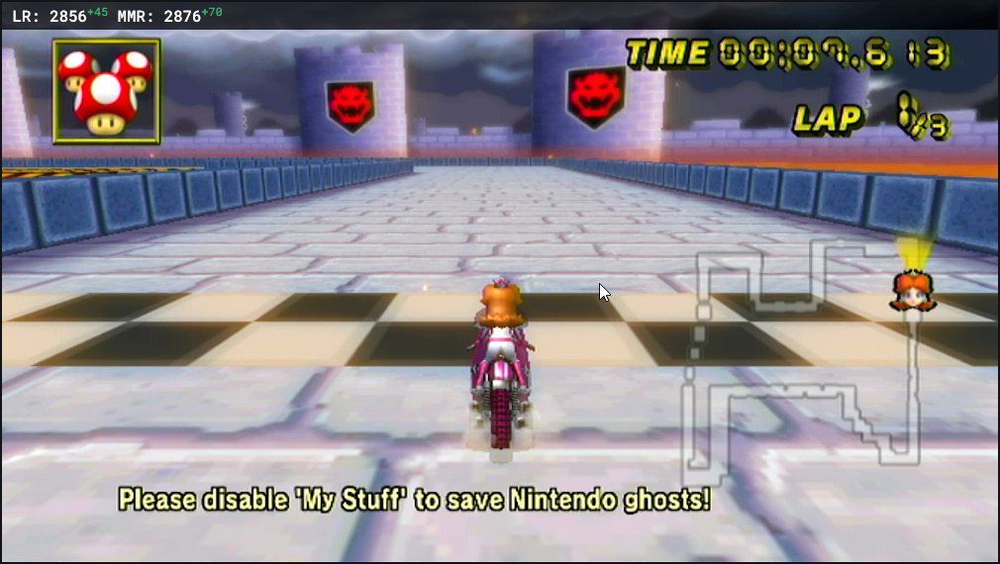

## A Dynamic LR and MMR Display for OBS
To use this display, insert your lounge name at the end of this url: https://blitzuuu.github.io/Lounge-Rating/?name=YOUR_LOUNGE_NAME

You can also use your player ID at the end of this url to avoid issues when changing your name: https://blitzuuu.github.io/Lounge-Rating/?id=YOUR_PLAYER_ID

Add either of these links as a *Browser Source* in OBS or whichever streaming/recording software you use. I personally set the width to 650 and height to 75, but this will depend on your text styling.

The name database is updated every 24 hours at midnight UTC, so if you have changed you name within the past 24 hours it may still only work with your old name until the database is updated.

If you would like to change the text style you can do so in the *Custom CSS* section in OBS, for example I style mine like this: 

```
#player-stats {
	color: white;
	font-family: 'Roboto Mono', monospace;
	font-size: 30px;
	font-weight: 500;
}
```
### Output
This is what the output looks like (*Note: I also have a semi-transparent black colour source behind my text in OBS to make it more readable*)


